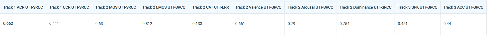

# VoiceMOS Challenge 2026

Dự án tham gia **VoiceMOS Challenge 2026** — cả 3 track, **dồn sức vào Track 2 (Emotional TTS)**: xây hệ thống tự động dự đoán điểm MOS cho giọng nói cảm xúc. Mục tiêu kép: thứ hạng tốt trên CodaBench (metric **UTT-SRCC**) + viết **paper ICASSP 2027**.

> 📅 Cập nhật: 10/6/2026 · 🔴 Hạn nộp kết quả: **7/8/2026** (eval thả 31/7) · 📝 Hạn paper: 16/9/2026

---

## 🏆 Điểm tốt nhất hiện tại (best-per-column, đã nộp DEV)

| Track | Điểm |
|---|---|
| **Track 1** (Speech Enhancement) | ACR/CCR = **0.662 / 0.411** (baseline) |
| **Track 2** (Emotional TTS) | QMOS **0.6296** (exp13) · EMOS **0.8116** · CAT err **0.1331** · VAD VAL/ARO/DOM **0.6605 / 0.7978 / 0.7539** (ARO = exp15 Mamba, 10/6) |
| **Track 3** (Codec Synthesis) | SPK/ACC = **0.451 / 0.44** (baseline) |

**Leaderboard CodaBench (DEV, chụp 10/6/2026):**



> QMOS vừa được **exp13 (fine-tune UTMOS) phá trần 0.548 → 0.63** ngày 10/6; 5 cột cảm xúc tốt nhất từ exp08/exp08b (fine-tune WavLM). Bản nộp gom-tốt-nhất gần đây = trộn cột `exp_mix_q07_emo08` (9/6, QMOS còn 0.548) → bản trộn mới QMOS←exp13 đang chờ nộp. Chi tiết tiến hóa exp01→exp13: [docs/04_experiments_log.md](docs/04_experiments_log.md).

---

## Bài toán Track 2 (trọng tâm)
Cho 1 đoạn giọng cảm xúc (TTS hoặc người thật), dự đoán **6 cột**:

| Cột | Mô tả | Bắt buộc |
|---|---|---|
| **QMOS** | MOS chất lượng giọng (1–5) | ✅ |
| **EMOS** | MOS độ khớp cảm xúc target (1–5) | ✅ |
| **EmoCat** | Tỉ lệ vote 5 cảm xúc (Neutral/Happy/Sad/Angry/Surprise) | tùy chọn |
| **VAD** | Valence / Arousal / Dominance | tùy chọn |

Nộp `answer.txt` (`wav,QMOS,EMOS,CAT,VAL,ARO,DOM`). Metric chính: **UTT-SRCC**. Đặc tả đầy đủ: [docs/08_track2_spec.md](docs/08_track2_spec.md).

---

## Cấu trúc thư mục
```
VoiceMOS Challenge 2026/
├── README.md  CLAUDE.md          # tổng quan + quy ước làm việc (CLAUDE.md = luật cho mọi session)
├── docs/                         # toàn bộ tài liệu 00..21 (xem bảng dưới)
├── kaggle_baseline/              # notebook + pipeline 3 track + experiment Track 2 + demo
│   ├── track1/ track2/ track3/   # baseline từng track
│   ├── expNN_*.{ipynb,py}        # experiment Track 2 (exp01..exp16)
│   ├── demo_all_tracks_gradio.*  # demo Gradio 3 track
│   └── demo_api_client_kaggle.*  # client gọi API 3 track từ Kaggle (urllib, resume)
├── api_service/                  # FastAPI REST 3 track (Docker) → deploy HF Space
├── baselines/                    # repo clone: vmc2026-baselines, UTMOS22, emotion2vec
├── data/                         # dữ liệu thô (không commit; dùng qua Kaggle Dataset)
├── submissions/                  # file nộp + kết quả chấm (Track1/2/3)
├── slide/                        # slide present 3 track (render từ docs/21)
└── reference/                    # tài liệu tham khảo (content_btc/, understand/)
```

## Cấu trúc tài liệu (`docs/`)
| File | Nội dung |
|---|---|
| [00_challenge_overview.md](docs/00_challenge_overview.md) | Tóm tắt cuộc thi, timeline, deadline |
| [01_research_plan.md](docs/01_research_plan.md) | Kế hoạch nghiên cứu, milestone |
| [02_mentor_questions.md](docs/02_mentor_questions.md) | Câu hỏi & trả lời từ mentor |
| [03_literature_notes.md](docs/03_literature_notes.md) | Ghi chú đọc paper |
| [04_experiments_log.md](docs/04_experiments_log.md) | **Nhật ký thí nghiệm** (nguồn cho paper) |
| [05_setup_environment.md](docs/05_setup_environment.md) | Hướng dẫn môi trường, setup |
| [06_baseline_repos.md](docs/06_baseline_repos.md) | Repo baseline đã clone & cách setup |
| [07_project_summary.md](docs/07_project_summary.md) | **Tóm tắt toàn bộ dự án** (đọc đầu tiên) |
| [08_track2_spec.md](docs/08_track2_spec.md) | Đặc tả Track 2: dataset, 6 metric, format `answer.txt` |
| [09_tracks_overview.md](docs/09_tracks_overview.md) | Đặc tả & so sánh cả 3 track |
| [10_learning_roadmap.md](docs/10_learning_roadmap.md) | Lộ trình học cho người mới |
| [11_progress_reports.md](docs/11_progress_reports.md) | **Báo cáo tiến độ** (mới nhất trên cùng) |
| [12_system_description.md](docs/12_system_description.md) | System description + bảng điểm từng track |
| [13_daily_todo.md](docs/13_daily_todo.md) | **Todo hằng ngày** |
| [14_leaderboard_metrics.md](docs/14_leaderboard_metrics.md) | Giải thích từng cột điểm leaderboard |
| [15_paper_draft.md](docs/15_paper_draft.md) | Bản nháp paper (tư duy tiếng Việt) |
| [16_model_architectures.md](docs/16_model_architectures.md) | Kiến trúc model nền (cho người mới) |
| [17_dl_keywords.md](docs/17_dl_keywords.md) | Keyword deep learning |
| [18_leaderboard_history.md](docs/18_leaderboard_history.md) | Lịch sử leaderboard qua các ngày |
| [19_paper_v1_en.md](docs/19_paper_v1_en.md) | **Bản paper v1 (TIẾNG ANH)** để nộp ICASSP |
| [20_experiments_overview.md](docs/20_experiments_overview.md) | Bảng trạng thái nhanh các exp |
| [21_slides_3_tracks.md](docs/21_slides_3_tracks.md) | Slide present 3 track (Marp) — bản v1 ngắn |
| [22_slides_v2_paper_style.md](docs/22_slides_v2_paper_style.md) | **Slide v2 (paper-style, ~36 slide)** — bài toán + cách chấm có ví dụ + từng layer 3 track + training + ablation |

---

## 🌐 Demo & API trên Hugging Face (đã deploy)

**🎛️ Demo UI (Gradio, 3 tab)** — giao diện kéo-thả audio chấm cả 3 track:
- Space: https://huggingface.co/spaces/tranminhtoan140601/voicemos2026-demo
- App trực tiếp: https://tranminhtoan140601-voicemos2026-demo.hf.space
- ⚡ HF Space free chỉ có CPU (chậm) → chạy nhanh trên **Kaggle T4** qua [kaggle_baseline/demo_run_from_hf.ipynb](kaggle_baseline/demo_run_from_hf.ipynb) (kéo `app.py` từ Space → chạy GPU → link `gradio.live`).

**🔌 API service (FastAPI REST, đóng Docker)** — chấm MOS tự động qua HTTP, đang **RUNNING** (free CPU). Code: [api_service/](api_service/).
- Space: https://tranminhtoan140601-voicemos2026-api.hf.space · Swagger: `/docs`
- Endpoint: `POST /track1` (ACR+CCR) · `POST /track2` (QMOS+EMOS+CAT+VAD) · `POST /track3` (spk+acc) · `GET /health`
- Gọi hàng loạt từ Kaggle: [kaggle_baseline/demo_api_client_kaggle.ipynb](kaggle_baseline/demo_api_client_kaggle.ipynb)

**📦 Checkpoint & code (HF Models):** `tranminhtoan140601/voicemos2026-track2-emotion` (checkpoint) · `…/voicemos2026-code` (pipeline).

**🎞️ Slide thuyết trình 3 track (mentor giao):**
- **v2 paper-style (~36 slide, khuyên dùng):** HTML [slide/voicemos2026_slides_v2.html](slide/voicemos2026_slides_v2.html) · nguồn [docs/22_slides_v2_paper_style.md](docs/22_slides_v2_paper_style.md) — thêm cách chấm (SRCC/CAT-ERR ví dụ tính tay), bảng từng layer cả 3 track, training details, ablation, số liệu 10/6 (QMOS 0.6296 · ARO 0.7978).
- v1 ngắn (~23 slide): HTML [slide/voicemos2026_slides.html](slide/voicemos2026_slides.html) · nguồn [docs/21_slides_3_tracks.md](docs/21_slides_3_tracks.md)
- Render lại / export PDF-PPTX: `npx @marp-team/marp-cli docs/22_slides_v2_paper_style.md --html --no-stdin -o slide/voicemos2026_slides_v2.html` (bắt buộc cờ `--html` để hiện hình SVG; thiếu `--no-stdin` sẽ treo).

---

## Cách bắt đầu
1. Đọc [docs/07_project_summary.md](docs/07_project_summary.md) → nắm bức tranh tổng thể.
2. Xem [docs/11_progress_reports.md](docs/11_progress_reports.md) (báo cáo trên cùng) → biết phiên gần nhất làm gì.
3. Setup môi trường: [docs/05_setup_environment.md](docs/05_setup_environment.md) (chạy nặng trên **Kaggle T4**).
4. Ghi lại **mọi thí nghiệm** (config → kết quả → nhận xét) vào [docs/04_experiments_log.md](docs/04_experiments_log.md).

> 🤖 Làm việc cùng Claude: gõ **"đọc"** để tóm tắt dự án đang ở đâu · **"xong"** để tự cập nhật docs cuối phiên (quy ước trong [CLAUDE.md](CLAUDE.md)).

---

## Liên kết quan trọng
- Website challenge: https://sites.google.com/view/voicemos-challenge/voicemos-challenge-2026
- Baseline repo: https://github.com/voicemos-challenge/vmc2026-baselines
- Nền tảng thi (CodaBench): https://www.codabench.org/competitions/16419/
- Liên hệ BTC: voicemos.challenge@gmail.com (đầu mối: Wen-Chin Huang, Nagoya University)

### Demo Gradio (Kaggle) — baseline 3 track
- Track 1: https://www.kaggle.com/code/minhtoan2/track1-gradio-baseline
- Track 2: https://www.kaggle.com/code/minhtoan2/track2-gradio-baseline
- Track 3: https://www.kaggle.com/code/minhtoan2/track3-gradio-baseline

> Notebook nguồn: `kaggle_baseline/track{1,2,3}/demo_track{1,2,3}_gradio.ipynb`.

---

## Thông tin liên hệ
- **Người làm:** Tran Minh Toan
- **Mentor:** *(điền tên mentor)*
- **Đơn vị:** *(điền tên trường/lab)*
